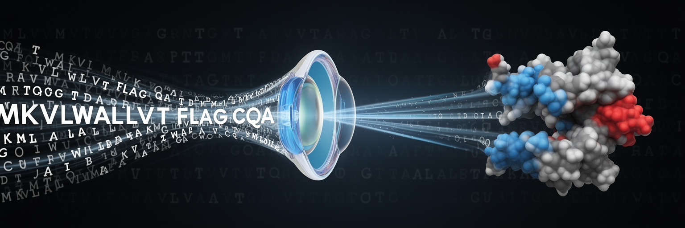

  

# LA^SR: Language modeling with AI for Algal Amino Acid Sequence Representation 🧬

🔬 Illuminating the
             Dark Proteome

LA^SR (pronounced "laser") 🎯 is a framework for implementing state-of-the-art language models to process microbial genomic data and extract otherwise intractable information. It excels at distinguishing between algal and bacterial sequences with high accuracy and unprecedented speed (16,580x faster than BLAST with ~3x higher recall rate).

## 🧫 Key Features

- **Multiple AI Model Architecture Support** 🏗️
  - Transformer-based: GPT variants, DistilRoBERTa, BLOOM, Mistral
  - State-space models: Mamba
- **Rich Interpretability Tools** 🔍
  - HELIX (Hidden Embedding Layer Information eXplorer)
  - DeepLift LA^SR
  - Deep Motif Miner Pro (DMMP)
- **Flexible Processing & GPU Acceleration** 🚄
  - Terminal Information (TI) inclusive/free processing
  - Fully optimized for modern GPU architectures

## 📄 License

This project is licensed under the MIT License - see the [LICENSE](LICENSE) file for details.

---

🧬 Empowering Microbial Genomics with AI 🧬

Made by the LA4SR Team

